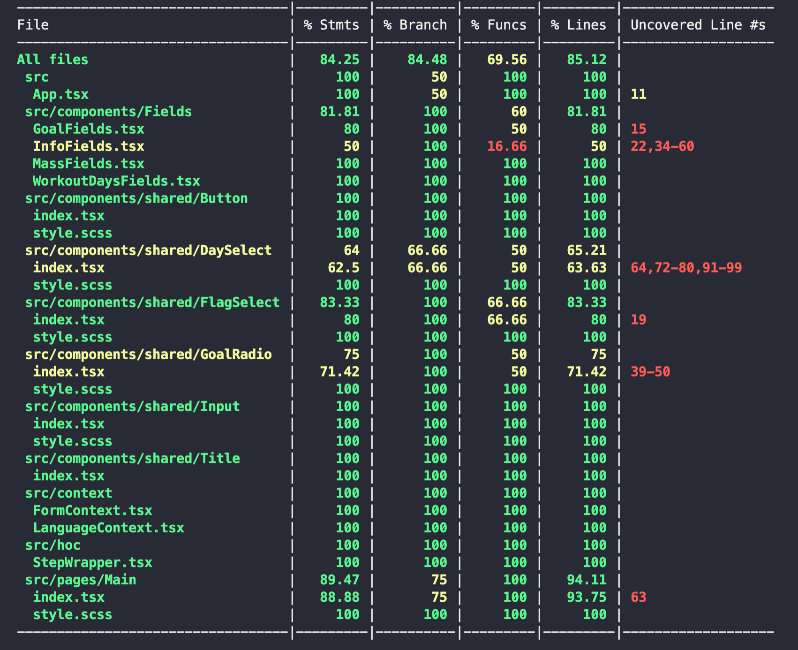

## Registration Step Form
---

<br>

## [Live Demo](https://62dd851daa4c700008cb379c--sparkly-chimera-1a2b97.netlify.app/)

<br>

### In order to run it locally,

Clone the repository

```bash
git clone https://github.com/atilaykosker/kompanion-form.git
```

then install the dependencies,

```bash
yarn
```

finallly,

```bash
yarn start
```

to start the development mode.

<br/>

# TESTS

**The project was developed according to the TDD approach.**
To see the test coverage,

```bash
yarn coverage
```

## Here are the test results,


<br/>

---
